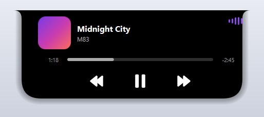

# Music Island 🎵

Une **« Dynamic Island »** pour **Windows**, dédiée à la musique — inspirée de l'encoche
iPhone/Mac et de [DynamicWin](https://github.com/FlorianButz/DynamicWin).

Une petite pastille discrète apparaît **en haut au centre de l'écran** dès qu'une musique
joue (n'importe quelle appli : Spotify, Deezer/YouTube dans le navigateur, etc.). Au
**survol**, elle s'agrandit en un panneau façon Apple.

## Aperçu

**Repliée** (mini-île avec visualiseur) :


**Déployée** (au survol) :



## Fonctionnalités

- 🎧 **Marche avec tout** : lit la « session média » globale de Windows
  (`GlobalSystemMediaTransportControlsSessionManager`).
- ✨ **Mini-île + visualiseur** : petite pastille avec des barres qui **réagissent au son
  réel** et prennent les **couleurs de la pochette**.
- 🖱️ **Survol animé** : s'agrandit / rétracte en douceur.
- ⏯️ **Contrôles** : précédent / lecture-pause / suivant.
- ⏱️ **Timeline** : position + temps restant, **glisser pour se déplacer** dans le morceau.
- 🔊 **Volume** à la **molette** de la souris au-dessus de l'île.
- 🎨 **Look Apple** : noir profond, coins concaves en haut (façon Mac), ombre portée,
  boutons pleins arrondis.
- 🫥 **Auto-masquage** : disparaît quand il n'y a **pas de musique** ou qu'une appli est en
  **plein écran** (jeu, vidéo YouTube/Netflix…).
- 🔔 **Icône dans la zone de notification** : activer/désactiver l'île, démarrer avec
  Windows, quitter.

## Installation / utilisation

Deux façons de lancer Music Island, au choix : **sans rien installer** (l'exécutable) ou
**depuis le code Python**.

### 🅰️ Sans Python — l'exécutable `.exe`

Aucune dépendance à installer, pas besoin de Python : tout est empaqueté dans le `.exe`.

- **Le plus simple** : télécharge `MusicIsland.exe` et **double-clique** dessus. Une icône
  apparaît en bas à droite (parfois dans le **débordement `^`**) : **clic droit** pour le
  menu, **clic gauche** pour activer/désactiver.
- **Pour le retrouver dans la recherche Windows** : télécharge aussi `installer.bat` (dans
  le même dossier que l'exe) et **double-clique sur `installer.bat`**. Ça copie l'appli et
  crée un raccourci → tu la lances ensuite en tapant **« Music Island »** dans le menu
  Démarrer. (Désinstallation : `desinstaller.bat`.)

> ⚠️ **« Windows a protégé votre ordinateur » / antivirus** : l'appli n'est **pas signée**
> (un certificat de signature est payant), donc Windows affiche un avertissement
> « éditeur inconnu ». Ce **n'est pas un virus** — c'est le cas de beaucoup d'apps indé.
> Clique sur **« Informations complémentaires » → « Exécuter quand même »**. Si un antivirus
> la met en quarantaine, c'est un **faux positif** (dû à PyInstaller) : ajoute une exception.

### 🅱️ Avec Python — depuis les sources

Tu préfères lancer le code directement (pour le lire, le modifier, ou éviter le `.exe`) ?
Il te faut **Python 3.11+** sur Windows, puis :

```bash
git clone https://github.com/Enivox/Island-Dev.git
cd Island-Dev
python -m pip install -r requirements.txt
python music_island.py
```

C'est exactement la même appli que l'exe — juste lancée depuis le source.

### 🔨 (Optionnel) Générer l'exécutable soi-même

L'icône `icon.ico` et le fichier `MusicIsland.spec` sont fournis. Depuis les sources
(après le `pip install` ci-dessus) :

```bash
pyinstaller MusicIsland.spec
```

Résultat : `dist/MusicIsland.exe` (un seul fichier, ~60 Mo, sans console).

## Stack technique

| Besoin | Outil |
| --- | --- |
| Interface (fenêtre sans bordure, transparente, animée) | **PySide6** |
| Infos & contrôles musique | **winrt** (`Windows.Media.Control`) |
| Volume + niveau audio (visualiseur) | **pycaw** |
| Génération du `.exe` | **PyInstaller** |

> ⚠️ Le paquet `winsdk` n'existe pas pour Python 3.14. On utilise son successeur officiel
> **`winrt`** (projet PyWinRT) : même API Windows, seul le préfixe d'import change.
